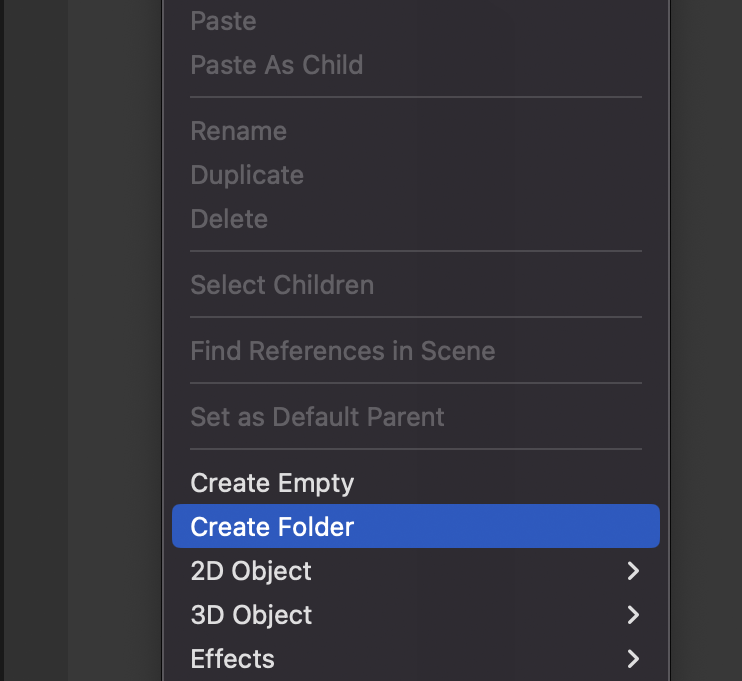
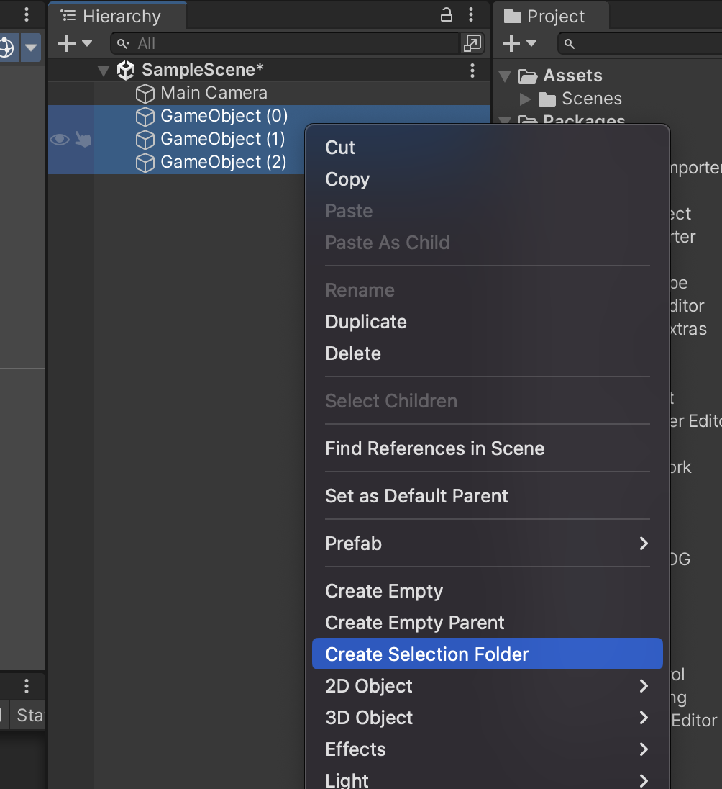

# 시작해요
UFolder는 계층 구조를 정리할 수 있는 유니티 에디터 확장입니다.

---
## 폴더 만들기

Hierarchy에서 오른쪽 마우스 -> Create Folder를 클릭하면 폴더가 생성됩니다.

## 다중 선택하여 폴더에 넣기
  
폴더에 담고 싶은 오브젝트를 다중으로 선택한 상태에서 Create Selected Folder를 클릭하면 폴더가 생성되고 선택한 오브젝트가 폴더에 들어갑니다.

> [!TIP]
> 폴더에 담고 싶은 오브젝트를 선택하고 단축키 G를 누르면 폴더를 생성할 수 있습니다.